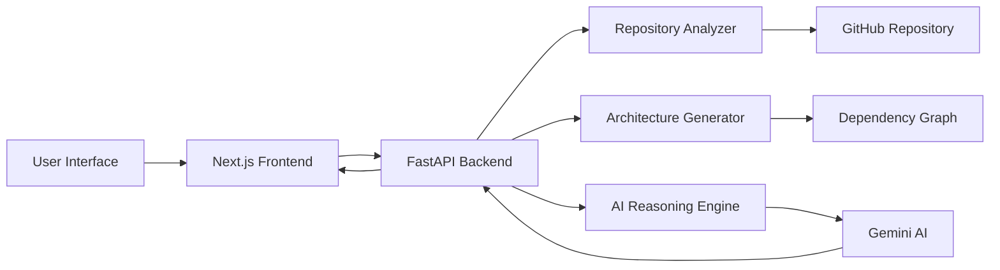
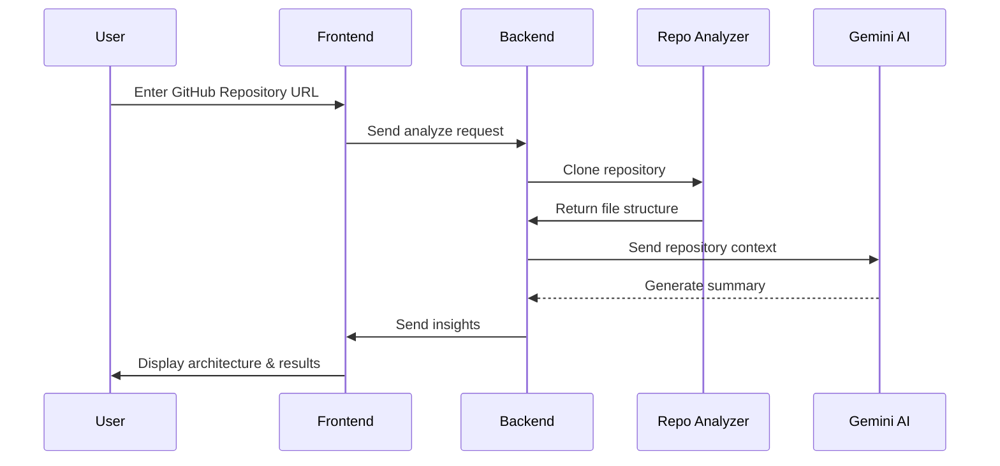

# 🧠 AI Codebase Explorer — AI-Powered Repository Understanding Platform


---

# 🚀 Overview

AI Codebase Explorer is an intelligent developer tool designed to automatically analyze and explain software repositories using Artificial Intelligence. By providing a GitHub repository URL, the system performs automated analysis to understand:
- repository structure
- dependencies
- architecture
- file responsibilities
- overall system design

The platform combines **static code analysis** with **Large Language Models (LLMs)** to generate architecture insights, file explanations, and conversational answers about the codebase. It consists of a **FastAPI backend** responsible for repository analysis and AI reasoning and a **Next.js frontend** that provides an interactive developer dashboard with architecture graphs and repository insights. The goal of the project is to help developers quickly understand unfamiliar codebases and reduce onboarding time when working with new repositories.

---

# ✨ Key Features

- 📂 GitHub repository analysis
- 🧠 AI-generated project summaries
- 🏗 Automatic architecture diagram generation
- 🌐 Interactive dependency visualization
- 💬 Chat with your repository using AI
- 📄 File-level explanation
- 🌳 Interactive repository file tree
- 📊 Repository statistics dashboard
- ⚡ Developer-tool style interface
- 🔍 Context-aware AI responses

---

# 🛠 Tech Stack

## 💻 Backend (AI Analysis Engine)

The backend is built using **Python and FastAPI** and is responsible for analyzing repositories and communicating with the AI model.

| Technology | Purpose |
|-----------|--------|
| **Python 3.10+** | Core programming language |
| **FastAPI** | High-performance REST API framework |
| **GitPython** | Clone and manage GitHub repositories |
| **AST Parsing** | Analyze Python code structure |
| **NetworkX** | Build dependency graphs |
| **Google Gemini API** | AI reasoning and code summarization |
| **Uvicorn** | ASGI server for FastAPI |

### Backend Responsibilities

- Clone GitHub repositories
- Scan file structure
- Extract dependencies
- Generate architecture graphs
- Provide AI explanations
- Handle API requests from frontend

---

## 🖥 Frontend (Developer Dashboard)

The frontend provides a modern interactive UI for exploring repository insights.

| Technology | Purpose |
|-----------|--------|
| **Next.js** | React framework for building UI |
| **React** | Component-based frontend library |
| **React Flow** | Interactive architecture graph visualization |
| **Tailwind CSS** | Modern styling framework |
| **Framer Motion** | UI animations |
| **Lucide Icons** | UI icons |
| **Mermaid.js** | Architecture diagram rendering |

### Frontend Responsibilities

- Display architecture graphs
- Provide repository explorer
- Show AI explanations
- Enable chat with repository
- Visualize project insights

---

## ☁️ Infrastructure

| Component | Purpose |
|----------|--------|
| GitHub | Repository source |
| Gemini AI | AI reasoning and summarization |
| REST API | Backend-frontend communication |
| Local environment | Development setup |

---

# 🧠 AI Capabilities

The system uses **Large Language Models** to provide intelligent insights about codebases.

Capabilities include:

- Code summarization
- Architecture inference
- File explanation
- Dependency understanding
- Conversational repository analysis

---

# 🏗 System Architecture



---

# 🔄 Processing Workflow



---

# 📂 Project Structure

```
AI-Codebase-Explorer/
│
├── backend/                          # Backend AI analysis engine
│   │
│   ├── main.py                       # FastAPI server entry point → uvicorn main:app --reload
│   │
│   ├── services/                     # Core analysis logic
│   │   │
│   │   ├── repo_analyzer.py          # Clone and analyze repositories → git clone <repo_url>
│   │   │
│   │   ├── architecture_service.py   # Generate dependency graphs → Build graph using NetworkX
│   │   │
│   │   ├── ai_service.py             # Gemini AI integration → Call Gemini API
│   │   │
│   │   └── file_explainer.py         # Explain source code files → Send file content to AI
│   │
│   ├── utils/                        # Helper utilities
│   │   │
│   │   ├── github_utils.py           # GitHub cloning utilities → git clone repository
│   │   │
│   │   └── parser_utils.py           # Code parsing helpers → AST parsing
│   │
│   └── requirements.txt              # Python dependencies → pip install -r requirements.txt
│
├── frontend/                         # Next.js frontend dashboard
│   │
│   ├── components/
│   │   │
│   │   ├── ArchitectureGraph.jsx     # Architecture visualization → Render graph using React Flow
│   │   │
│   │   ├── RepoChat.jsx              # Chat with repository → Send queries to /chat API
│   │   │
│   │   ├── RepoFileTree.jsx          # Repository file explorer → Fetch /repo-tree API
│   │   │
│   │   ├── FileExplainer.jsx         # File explanation panel → Call /explain-file API
│   │   │
│   │   ├── RepoSummary.jsx           # Display repository summary
│   │   │
│   │   ├── StatsCards.jsx            # Repository statistics
│   │   │
│   │   ├── Sidebar.jsx               # Navigation sidebar
│   │   │
│   │   └── Topbar.jsx                # Top navigation bar
│   │
│   ├── app/
│   │   │
│   │   └── page.js                   # Main dashboard page → npm run dev
│   │
│   └── package.json                  # Node dependencies → npm install
│
└── README.md                         # Project documentation
```
---

# 🚀 Getting Started

This section provides step-by-step instructions for setting up and running **AI Codebase Explorer** locally or deploying it to a cloud environment.

## 📋 Prerequisites

Before running the project, ensure your system has the necessary tools and accounts required for development and deployment.

## 🧰 Required Software

Install the following software:

| Software | Version | Purpose |
|--------|--------|--------|
| Python | 3.10+ | Backend development |
| Node.js | 18+ | Frontend development |
| npm / pnpm | Latest | Package management |
| Git | Latest | Repository cloning |
| VS Code / Cursor | Optional | Code editor |

Check installation:

```bash
python --version
node -v
npm -v
git --version
```

---

## 🔑 Required Accounts

The following accounts and API keys are required.

| Service | Purpose |
|-------|--------|
| Google AI Studio | Gemini API key for AI analysis |
| GitHub | Repository access |
| Vercel / Netlify (optional) | Frontend deployment |
| Render / Railway (optional) | Backend deployment |

---

# ⚙️ Environment Configuration

Create a `.env` file inside the **backend directory**.

```env
GEMINI_API_KEY=your_gemini_api_key
```

### Example

```
backend/
│
├── .env
├── main.py
├── requirements.txt
```

The backend reads this environment variable to communicate with the **Gemini AI API**.

---

# 🖥 Deployment Modes

AI Codebase Explorer supports two primary deployment modes:

1️⃣ **Local Development Mode**  
2️⃣ **Cloud Deployment Mode**

---

# 🔹 Mode 1 — Local Deployment

This mode is recommended for **development and testing**.

---

## 1️⃣ Clone the Repository

```bash
git clone https://github.com/Shaheem-B/AI-Codebase-Explorer.git
cd AI-Codebase-Explorer
```

---

## 2️⃣ Backend Setup

Navigate to backend directory

```bash
cd backend
```

Create virtual environment

```bash
python -m venv venv
```

Activate environment

### Windows

```bash
venv\Scripts\activate
```

### Linux / macOS

```bash
source venv/bin/activate
```

Install dependencies

```bash
pip install -r requirements.txt
```

Run backend server

```bash
uvicorn main:app --reload
```

Backend will start at:

```
http://127.0.0.1:8000
```

FastAPI documentation:

```
http://127.0.0.1:8000/docs
```

---

## 3️⃣ Frontend Setup

Open a new terminal and navigate to frontend.

```bash
cd frontend
```

Install dependencies

```bash
npm install
```

Start development server

```bash
npm run dev
```

Frontend will run at:

```
http://localhost:3000
```

---

# ☁️ Mode 2 — Cloud Deployment

For production use, the system can be deployed to the cloud.

---

## Backend Deployment

Recommended platforms:

- Render
- Railway
- AWS
- DigitalOcean

Example using **Render**

### 1️⃣ Push repository to GitHub

```
git push origin main
```

### 2️⃣ Create Web Service

Connect your GitHub repo and configure:

```
Build Command: pip install -r requirements.txt
Start Command: uvicorn main:app --host 0.0.0.0 --port 10000
```

Add environment variables:

```
GEMINI_API_KEY=your_key
```

---

## Frontend Deployment

Recommended platforms:

- Vercel
- Netlify

Example using **Vercel**

```
npm install -g vercel
vercel
```

Follow prompts to deploy.

---

## Frontend Setup

Navigate to frontend folder

```bash
cd ../frontend
```

Install dependencies

```bash
npm install
```

Run development server

```bash
npm run dev
```

Frontend runs at:

```
http://localhost:3000
```

---

# 🧠 System Design Considerations

AI Codebase Explorer combines **static analysis with AI reasoning**.

---

## Why Static Code Analysis?

Static analysis allows the system to understand:

- file structure
- module relationships
- dependency graph
- repository statistics

without executing the code.

---

## Why AI Reasoning?

Large Language Models provide:

- natural language explanations
- architectural insights
- conversational interaction with repositories
- intelligent summaries

---

## Combined Approach

The system architecture combines both:

```
Static Analysis → Extract structure
AI Model → Interpret and explain structure
```

This hybrid approach produces **more accurate explanations than AI alone**.

---


# 🧪 Testing Checklist

Before deploying or demonstrating the project, verify the following:

| Test Case | Expected Result |
|---------|----------------|
| Backend server starts | FastAPI running on port 8000 |
| Frontend loads | Dashboard accessible |
| Repository analysis | Summary generated |
| Architecture graph | Visualized correctly |
| File explanation | AI explanation returned |
| Repo chat | AI answers questions |
| API docs | Accessible at `/docs` |

---

# 📡 API Endpoint Reference

The backend exposes several REST APIs for analyzing repositories and interacting with the AI engine.

Base URL:

```
http://127.0.0.1:8000
```

---

## API Endpoints

| Endpoint | Method | Description |
|---------|--------|-------------|
| `/analyze` | POST | Analyze GitHub repository |
| `/diagram` | POST | Generate architecture graph |
| `/repo-tree` | GET | Retrieve repository file structure |
| `/explain-file` | POST | Explain a specific file |
| `/chat` | POST | Ask questions about repository |
| `/architecture-intel` | GET | Get architecture insights |
| `/` | GET | API health check |

---

## Example API Request

### Analyze Repository

```json
POST /analyze
{
  "repo_url": "https://github.com/user/repository"
}
```

### Response

```json
{
  "repo_name": "example-project",
  "summary": "AI generated explanation of repository",
  "files_count": 120,
  "languages": ["Python", "JavaScript"]
}
```

---

## FastAPI Interactive Documentation

FastAPI automatically generates Swagger documentation.

Open:

```
http://127.0.0.1:8000/docs
```

You can test all APIs directly from the browser.


---

# 🔮 Roadmap

### Phase 1 — Stability

- Improve repository parsing
- Optimize architecture analysis
- Improve UI performance

### Phase 2 — Feature Expansion

- GitHub OAuth login
- Pull request analysis
- Code smell detection
- AI refactoring suggestions

### Phase 3 — Intelligence Upgrade

- Vector database for repository memory
- Retrieval-augmented generation
- Multi-repository understanding

### Phase 4 — Developer Platform

- SaaS deployment
- Team collaboration
- Enterprise integrations

---

# 🙏 Acknowledgements

This project is built using powerful open-source technologies:

- FastAPI
- Next.js
- React Flow
- Google Gemini AI
- Open-source developer community

---

# 📜 License

MIT License

Copyright (c) 2026 Shaheem B.

Permission is hereby granted, free of charge, to any person obtaining a copy of this software and associated documentation files to deal in the Software without restriction.


